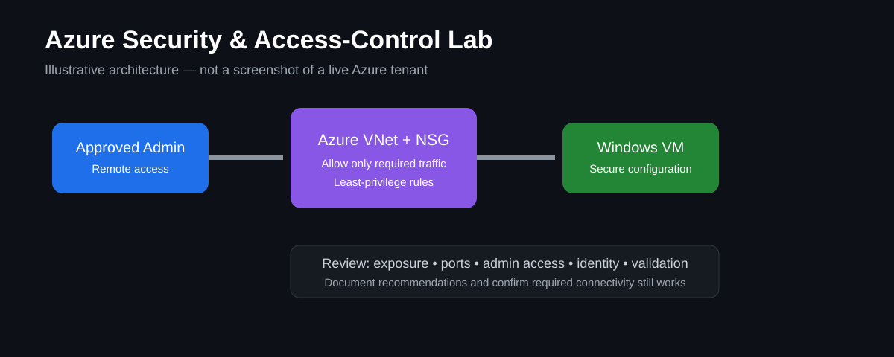

# Azure Security & Access-Control Lab

> **Portfolio visual:** This diagram illustrates the security design reviewed in the lab. It is not a screenshot of a live Azure tenant.

## Goal
Expand existing Azure networking work into a security-focused project covering cloud access, network controls, identity concepts, secure configuration, and documentation.

## What this lab demonstrates
- Azure virtual machine and network security concepts
- Network Security Group (NSG) review
- Remote access considerations
- Identity and access concepts
- Secure configuration review
- Clear documentation of security decisions

## Lab workflow
1. Review an Azure virtual network and connected lab virtual machines.
2. Document inbound and outbound NSG rules.
3. Identify rules that are broader than necessary.
4. Review how remote access is provided to the VM.
5. Review local/admin account usage and identity concepts.
6. Document recommended security improvements.
7. Validate that required connectivity still works after approved changes.

## Security review checklist
- [ ] Public exposure documented
- [ ] NSG rules reviewed for least privilege
- [ ] Remote access method documented
- [ ] Administrative access reviewed
- [ ] Unnecessary services/ports identified
- [ ] Security recommendations documented
- [ ] Connectivity validated after changes

## Example documentation table
| Control Area | Current State | Risk | Recommendation | Validation |
|---|---|---|---|---|
| RDP access | Example only | Review required | Restrict source access | Test approved connection |
| NSG inbound rules | Example only | Review required | Apply least privilege | Confirm required traffic |

## Existing project connection
This lab can build on my existing Azure networking and Active Directory work by adding a formal security-review and documentation layer.

## Evidence to add after completing the lab
Add your own redacted Azure screenshots, NSG rule review, network diagram, configuration notes, and before/after validation. Do not publish credentials, subscription IDs, secrets, or sensitive network information.

## What I learned
Complete this section after running the lab. Explain which configuration choices mattered most, how you balanced access with security, and how you validated that the environment still functioned correctly.
