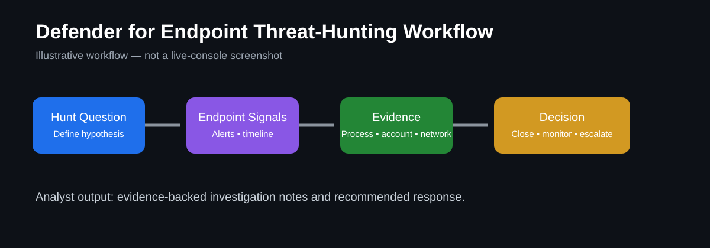

# Microsoft Defender for Endpoint Threat-Hunting Lab



> **Portfolio visual:** This diagram illustrates the investigation workflow. It is not a screenshot of a live Defender tenant.

## Goal
Document a structured threat-hunting workflow focused on reviewing endpoint security signals, identifying suspicious activity, recording evidence, and explaining escalation decisions.

## What this lab demonstrates
- Reviewing endpoint alerts and device activity
- Building a simple threat-hunting hypothesis
- Investigating suspicious process, account, or network behavior
- Recording evidence and investigation notes
- Explaining whether activity should be closed, monitored, or escalated

## Lab workflow
1. Start with a hunting question, such as: Are there repeated suspicious PowerShell executions or unusual sign-in patterns on endpoints?
2. Review device alerts and timeline activity in Microsoft Defender for Endpoint.
3. Collect relevant evidence: device, account, process, timestamp, alert name, and related activity.
4. Compare the activity against expected behavior.
5. Document findings and determine an escalation decision.

## Example Advanced Hunting query
```kusto
DeviceProcessEvents
| where Timestamp > ago(24h)
| where FileName =~ "powershell.exe"
| project Timestamp, DeviceName, AccountName, FileName, ProcessCommandLine
| order by Timestamp desc
```

## Investigation notes template
- **Hunt question:**
- **Alert or signal:**
- **Device:**
- **Account:**
- **Evidence reviewed:**
- **What appears normal:**
- **What appears suspicious:**
- **Decision:** Close / Monitor / Escalate
- **Reason:**
- **Recommended next step:**

## Validation checklist
- [ ] Hunting question documented
- [ ] Relevant endpoint data reviewed
- [ ] Evidence recorded
- [ ] Decision supported by evidence
- [ ] Next steps documented

## Evidence to add after completing the lab
Add your own redacted screenshots, query output, timeline notes, and a short explanation of what you learned. Do not include credentials, secrets, or private customer data.

## What I learned
Complete this section after running the lab and explain what signals were most useful, how you separated expected from suspicious activity, and what you would improve in a future hunt.
