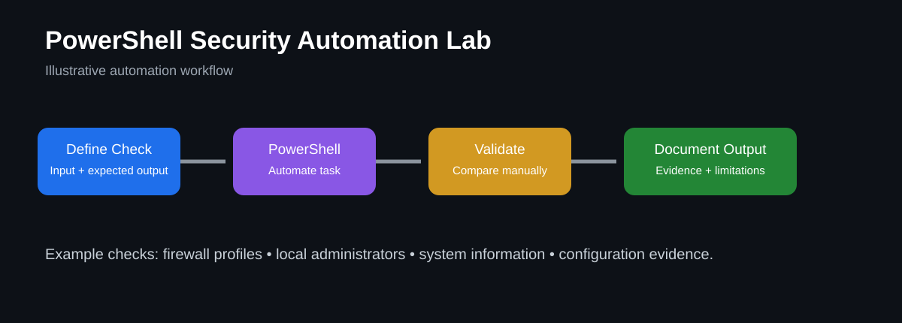

# PowerShell Security Automation Lab



> **Portfolio visual:** This diagram illustrates the automation workflow used in the lab.

## Goal
Build reusable PowerShell examples for administrative and security-support tasks, with documentation explaining the purpose, expected output, and validation steps.

## What this lab demonstrates
- PowerShell scripting fundamentals
- Automating repeatable administrative checks
- Collecting configuration evidence
- Producing simple security-support reports
- Validating script output before relying on it
- Documenting what the script does and why

## Lab workflow
1. Choose a repetitive administrative or security-support task.
2. Define the expected input and output.
3. Write a small PowerShell script to perform the check.
4. Test the script in a lab environment.
5. Review output for accuracy.
6. Document assumptions, limitations, and validation steps.

## Example 1: Firewall profile check
```powershell
$profiles = Get-NetFirewallProfile | Select-Object Name, Enabled, DefaultInboundAction, DefaultOutboundAction
$profiles | Format-Table -AutoSize
```

## Example 2: Local administrator membership review
```powershell
Get-LocalGroupMember -Group "Administrators" |
    Select-Object Name, ObjectClass, PrincipalSource
```

## Example 3: Basic system information collection
```powershell
Get-ComputerInfo |
    Select-Object WindowsProductName, WindowsVersion, OsArchitecture, CsName
```

## Documentation template
- **Task:**
- **Why automate it:**
- **Script purpose:**
- **Expected output:**
- **Validation method:**
- **Limitations:**
- **What I learned:**

## Validation checklist
- [ ] Script runs successfully in the lab
- [ ] Output matches manual verification
- [ ] Errors are handled or documented
- [ ] No credentials or secrets are hard-coded
- [ ] Script purpose and limitations are explained

## Evidence to add after completing the lab
Add your own script output, screenshots, and notes showing how you validated the results. Do not include passwords, API keys, tokens, or confidential system information.

## What I learned
Complete this section after testing your scripts. Explain what you automated, what you validated manually, what failed during testing, and how you improved the script.
