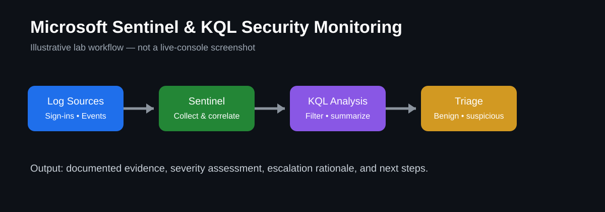

# Microsoft Sentinel & KQL Security Monitoring Lab



> **Portfolio visual:** This diagram illustrates the lab workflow. It is not a screenshot of a live Sentinel tenant.

## Goal
Demonstrate security-event review, alert triage, log analysis, and documentation using Microsoft Sentinel concepts and KQL queries.

## What this lab demonstrates
- Reviewing security events and alerts
- Using KQL to filter and summarize log data
- Identifying unusual sign-in or authentication patterns
- Documenting observations, evidence, severity, and next steps
- Explaining when an event should be escalated

## Lab workflow
1. Connect a supported log source to a Microsoft Sentinel workspace.
2. Confirm that events are arriving in Log Analytics.
3. Run basic KQL queries to understand normal activity.
4. Filter for failed sign-ins, unusual activity, or repeated events.
5. Document findings in the incident-notes template.
6. Record whether the event appears benign, suspicious, or requires escalation.

## Example KQL
```kusto
SigninLogs
| where TimeGenerated > ago(24h)
| summarize Attempts=count(), Failed=countif(ResultType != 0) by UserPrincipalName
| order by Failed desc
```

```kusto
SecurityEvent
| where TimeGenerated > ago(24h)
| summarize EventCount=count() by EventID, Computer
| order by EventCount desc
```

## Validation checklist
- [ ] Log source connected
- [ ] Events visible in Log Analytics
- [ ] Queries return expected data
- [ ] Findings documented
- [ ] Escalation rationale recorded

## Evidence to add after completing the lab
Add screenshots of your own Sentinel workspace, redacted query results, and a short write-up explaining what you observed and learned. Do not include passwords, tokens, private IP details that should remain confidential, or personal information.

## What I learned
Complete this section after running the lab. Explain what the queries showed, what was difficult, how you validated results, and what you would investigate next.
