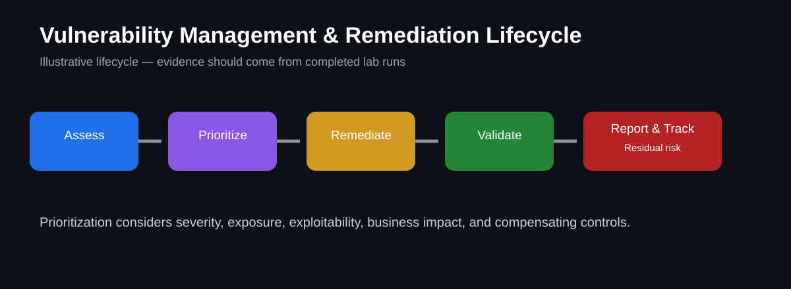

# Vulnerability Management & Remediation Lab



> **Portfolio visual:** This diagram illustrates the lifecycle used in the lab. Validation evidence should come from completed lab runs.

## Goal
Show the vulnerability-management lifecycle from assessment and prioritization through remediation tracking, validation, and reporting using Tenable concepts and PowerShell examples.

## What this lab demonstrates
- Reviewing vulnerability findings
- Prioritizing remediation by severity and exposure
- Documenting remediation actions
- Tracking status and ownership
- Validating whether a fix worked
- Communicating residual risk clearly

## Lab workflow
1. Review vulnerability scan findings from a lab or approved environment.
2. Categorize findings by severity, affected system, exposure, and business impact.
3. Select one or more findings for remediation.
4. Document the planned fix and expected outcome.
5. Apply the remediation in a controlled lab environment.
6. Re-scan or re-check the configuration to validate the fix.
7. Record the final status and any remaining risk.

## Remediation tracking template
| Finding | Severity | Asset | Planned Action | Owner | Status | Validation |
|---|---|---|---|---|---|---|
| Example finding | High | Lab VM | Apply secure configuration | Lab owner | Open | Pending |

## Example PowerShell validation
```powershell
Get-NetFirewallProfile | Select-Object Name, Enabled
```

```powershell
Get-Service | Where-Object {$_.Status -eq 'Running'} | Select-Object Name, DisplayName, Status
```

## Prioritization questions
- Is the system exposed to the internet?
- Is the vulnerability remotely exploitable?
- Is there a known exploit or active exploitation?
- What data or business function is affected?
- Is there a compensating control?
- How quickly can the remediation be safely validated?

## Validation checklist
- [ ] Finding documented
- [ ] Severity and exposure reviewed
- [ ] Remediation plan recorded
- [ ] Fix applied in an approved lab environment
- [ ] Validation completed
- [ ] Residual risk documented

## Evidence to add after completing the lab
Add redacted screenshots of your own vulnerability findings, before/after configuration checks, remediation notes, and validation results. Do not include customer data, credentials, tokens, or proprietary scan exports.

## What I learned
Complete this section after running the lab. Explain how you prioritized the finding, how you validated the remediation, and what you would do differently in a production environment.
